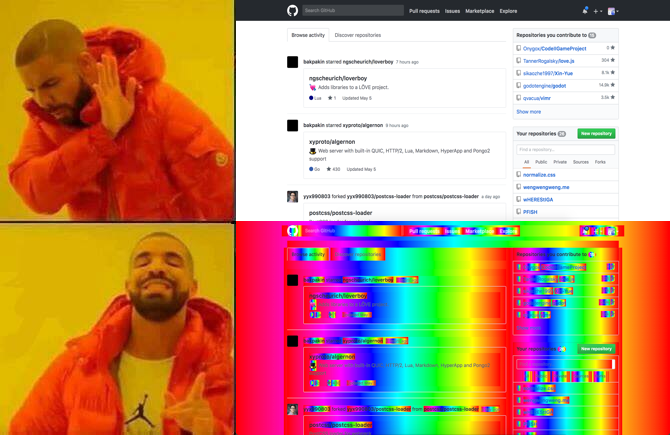

# normalize.css
> my implementation of normalize.css, make the web the way it should be

## demo


## user reactions


## installation & usage
**npm**
```shell
yarn add @slmjkdbtl/normalize.css
```
**CDN**
```html
<link rel="stylesheet" href="https://cdn.jsdelivr.net/npm/@slmjkdbtl/normalize.css@1.0.1/normalize.min.css">
```

inspired by [BreoganHackett's tweet](https://twitter.com/BreoganHackett/status/991687076029575168)
